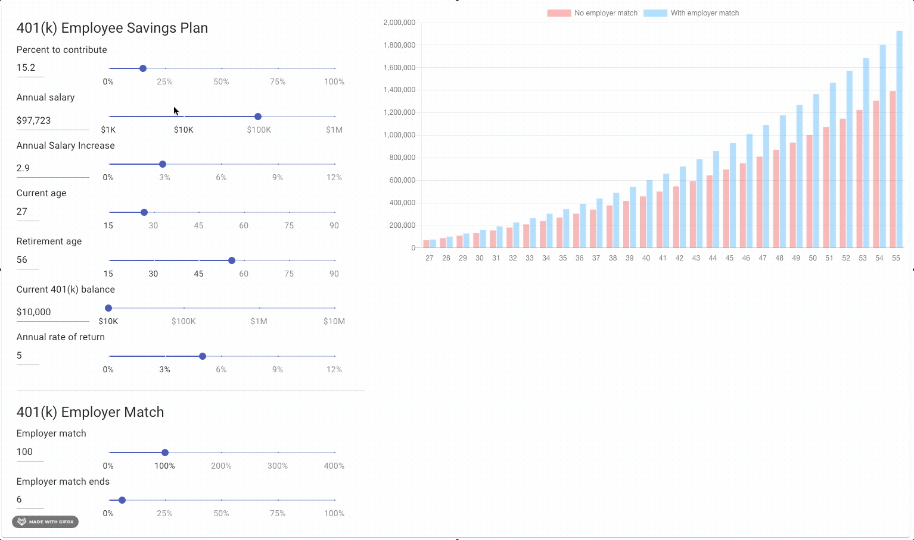

# Material UI 401(k) Calculator

This 401(k) Calculator is designed to help you accurately predict your 401(k) value at retirement.



This tool was created using several libraries, including:

Create-React-App
```npm install --save create-react-app```

Material UI
```npm install --save @material-ui/core```

React Number Format
```npm install --save react-number-format```

React chart-js-2 & Chart.js
```npm install --save react-chartjs-2 chart.js```


## Usage

Adjust each of the paramter sliders to match your current 401K trajectory:

__Employee parameters__
- Percentage of pre-tax annual income to contribute
- Annual pre-tax income
- Expected annual salary increase
- Current age
- Expected age of retirement
- Current 401(k) balance
- Annual rate of return
    - Lower rate of return = lower risk tolerance
    - Higher rate of return = higher risk tolerance

__Employer parameters__
- Employer contribution % match
- Employee salary % match cap

## Contributing

Pull requests are welcome. For major changes, please open an issue first to discuss what you would like to change. Please make sure to test all changes locally before submitting a pull request.

## License
[MIT](https://choosealicense.com/licenses/mit/)
